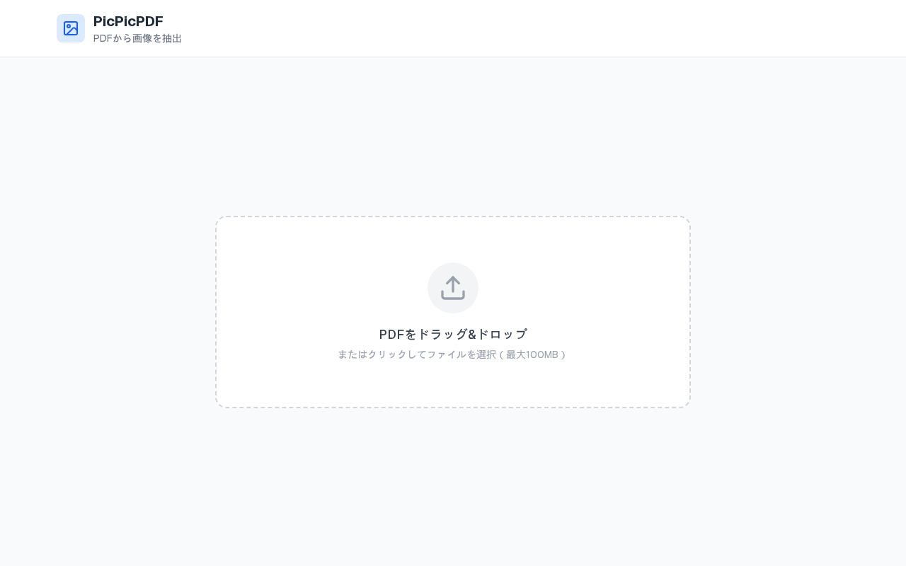

# PicPicPDF



## Overview
PicPicPDF is a simple web tool that extracts embedded images and font information from PDF and Adobe Illustrator (.ai) files. Just drag and drop a file, and embedded assets appear in a dashboard (Images / Fonts / Summary) ready for individual or ZIP download.

Key features:
- Drag & drop upload — supports PDF and Illustrator .ai (CS2+ PDF-compatible)
- Image extraction using PyMuPDF (fitz); JPEG 2000 (jpx/jp2) auto-converted to JPEG for browser compatibility
- Font list with per-font usage samples, detail modal, and real-font preview via embedded TTF/OTF (@font-face)
- Individual image download (click to download) and bulk ZIP download
- No login required — instant access utility

## Installation

### Prerequisites
- Node.js 18+
- Python 3 with PyMuPDF (`pip install PyMuPDF`) and Pillow (`pip install Pillow`) — Pillow is required for JPEG 2000 conversion

### Setup

1. Clone the repository:
```bash
git clone https://github.com/daishir0/picpicpdf.git
cd picpicpdf
```

2. Install dependencies:
```bash
npm install
```

3. Verify PyMuPDF is available:
```bash
python3 -c "import fitz; print(fitz.version)"
```

4. Build and start:
```bash
npm run build
PORT=3020 npm start
```

5. Open `http://localhost:<PORT>` in your browser (e.g. http://localhost:3020).

> ⚠️ **Port configuration — please read if you are deploying on a new server.**
> The port is **not** hardcoded in `package.json`. Set it via the `PORT` environment variable so the repository stays environment-agnostic.
>
> - **systemd unit** — add `Environment=PORT=3020` under `[Service]`.
> - **Docker / ECS / etc.** — pass `-e PORT=3020` or the platform equivalent.
> - **Local development** — `PORT=3020 npm run dev`, or create a `.env.local` with `PORT=3020`.
>
> If you omit `PORT`, Next.js falls back to its default (3000). Align your reverse proxy (nginx, ALB, Cloudflare, etc.) with whatever `PORT` you pick — do not edit `package.json` for per-server port changes, as it causes merge conflicts across deployments.

## Usage

1. Open the application URL in your browser
2. Drag and drop a PDF file onto the drop zone (or click to browse)
3. Wait for image extraction to complete
4. Browse the extracted image thumbnails
5. Click any thumbnail to download that image
6. Click "Download All (ZIP)" to download all images as a ZIP archive
7. Click "Upload another PDF" to process a new file

## Notes
- Maximum file size: 100MB (PDF or .ai)
- Extracted images and fonts are stored temporarily and automatically cleaned up after 10 minutes
- The tool extracts actual embedded images and fonts from the file structure, not page screenshots
- Supported image output formats: PNG, JPEG, GIF, BMP, TIFF, WebP (JPEG 2000 is auto-converted)
- Browser-renderable font previews require embedded TTF/OTF/WOFF/WOFF2; Type1 (.pfb) fonts are extracted but fall back to system-font preview

## License
This project is licensed under the MIT License - see the LICENSE file for details.

---

# PicPicPDF


## 概要
PicPicPDFは、PDFおよびAdobe Illustrator (.ai) ファイルから埋め込み画像とフォント情報を抽出するシンプルなWebツールです。ファイルをドラッグ&ドロップすると、ダッシュボード形式（画像／フォント／概要タブ）でアセットが表示され、個別またはZIPでダウンロードできます。

主な機能:
- ドラッグ&ドロップによるアップロード — PDFとIllustrator .ai（CS2以降のPDF互換形式）に対応
- PyMuPDF（fitz）を使用した埋め込み画像の抽出。JPEG 2000 (jpx/jp2) は自動的にJPEGへ変換しブラウザ互換化
- フォント一覧と使用例のサンプルテキスト表示、詳細モーダル、埋め込みTTF/OTFを使った実フォントプレビュー (@font-face)
- 個別画像ダウンロード（クリックでダウンロード）・ZIP一括ダウンロード
- ログイン不要 — すぐに使えるユーティリティ

## インストール方法

### 前提条件
- Node.js 18以上
- Python 3 + PyMuPDF（`pip install PyMuPDF`）+ Pillow（`pip install Pillow`） — Pillow は JPEG 2000 変換用に必須

### セットアップ

1. リポジトリをクローン:
```bash
git clone https://github.com/daishir0/picpicpdf.git
cd picpicpdf
```

2. 依存関係をインストール:
```bash
npm install
```

3. PyMuPDFが利用可能か確認:
```bash
python3 -c "import fitz; print(fitz.version)"
```

4. ビルドして起動:
```bash
npm run build
PORT=3020 npm start
```

5. ブラウザで `http://localhost:<PORT>` を開きます（例: http://localhost:3020）。

> ⚠️ **ポート設定について — 別サーバーで稼働させる担当者は必ずお読みください。**
> ポート番号は `package.json` に **ハードコードしていません**。環境依存を避けるため、`PORT` 環境変数で指定してください。
>
> - **systemd ユニット** — `[Service]` セクションに `Environment=PORT=3020` を追加
> - **Docker / ECS 等** — `-e PORT=3020` またはプラットフォーム相当の指定
> - **ローカル開発** — `PORT=3020 npm run dev` または `.env.local` に `PORT=3020` を記述
>
> `PORT` を省略すると Next.js のデフォルト (3000) が使われます。設定したポートとリバースプロキシ（nginx / ALB / Cloudflare 等）を合わせてください。`package.json` をサーバー毎に編集するとデプロイ間で merge 競合が起きるので避けてください。

## 使い方

1. ブラウザでアプリケーションのURLを開く
2. PDFファイルをドロップゾーンにドラッグ&ドロップ（またはクリックして選択）
3. 画像抽出の完了を待つ
4. 抽出された画像のサムネイルを確認
5. サムネイルをクリックすると個別ダウンロード
6. 「すべてダウンロード (ZIP)」をクリックでZIP一括ダウンロード
7. 「別のPDFをアップロード」をクリックで新しいファイルを処理

## 注意点
- ファイルサイズ上限: 100MB（PDFおよび.ai）
- 抽出された画像・フォントは一時保存され、10分後に自動削除されます
- ページのスクリーンショットではなく、ファイル構造に埋め込まれた実際の画像・フォントを抽出します
- 画像の対応出力フォーマット: PNG, JPEG, GIF, BMP, TIFF, WebP（JPEG 2000 は自動変換）
- 実フォントプレビューには埋め込み TTF/OTF/WOFF/WOFF2 が必要。Type1 (.pfb) フォントは抽出されますがプレビューはシステムフォントにフォールバックします

## ライセンス
このプロジェクトはMITライセンスの下で公開されています。詳細はLICENSEファイルを参照してください。
